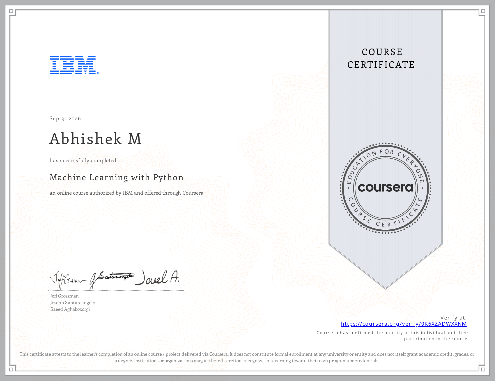

# Course 1: Machine Learning with Python

**Status:** ✅ Completed

## Certificate

## Overview
This course dives into the core principles of Machine Learning using Python. It covers supervised learning (classification and regression), unsupervised learning (clustering and dimensionality reduction), and evaluating model performance using Scikit-learn.

## Completed Notebooks

### Supervised Learning - Regression
- [Simple Linear Regression](./notebooks/Simple_Linear_Regression.ipynb)
- [Multiple Linear Regression](./notebooks/Multiple_Linear_Regression.ipynb)
- [Regularization in Linear Regression](./notebooks/Regularization_in_Linear_Regression.ipynb)
- [Regression Trees Taxi Tip](./notebooks/Regression_Trees_Taxi_Tip.ipynb)

### Supervised Learning - Classification
- [Logistic Regression](./notebooks/Logistic_Regression.ipynb)
- [Decision Trees](./notebooks/Decision_Trees.ipynb)
- [KNN Classification](./notebooks/KNN_Classification.ipynb)
- [Multi-class Classification](./notebooks/Multi_class_Classification.ipynb)
- [Decision Tree & SVM on Credit Card Fraud](./notebooks/Decision_Tree_SVM_Credit_Card_Fraud.ipynb)
- [Evaluating Classification Models](./notebooks/Evaluating_Classification_Models.ipynb)

### Unsupervised Learning
- [K-Means Customer Segmentation](./notebooks/K_Means_Customer_Segmentation.ipynb)
- [Evaluating K-Means Clustering](./notebooks/Evaluating_K_Means_Clustering.ipynb)
- [Comparing DBSCAN and HDBSCAN](./notebooks/Comparing_DBSCAN_HDBSCAN.ipynb)
- [PCA Dimensionality Reduction](./notebooks/PCA_Dimensionality_Reduction.ipynb)
- [t-SNE and UMAP](./notebooks/tSNE_and_UMAP.ipynb)

### Ensembles & Pipelines
- [Random Forests and XGBoost](./notebooks/Random_Forests_and_XGBoost.ipynb)
- [Evaluating Random Forest](./notebooks/Evaluating_Random_Forest.ipynb)
- [ML Pipelines and GridSearchCV](./notebooks/ML_Pipelines_and_GridSearchCV.ipynb)

### Projects
- **Practice Project:** [Titanic Survival Prediction](./notebooks/Practice_Project_Titanic_Survival.ipynb)
- **Final Project:** [AUS Weather Rainfall Prediction](./notebooks/Final_Project_AUS_Weather_Prediction.ipynb)

