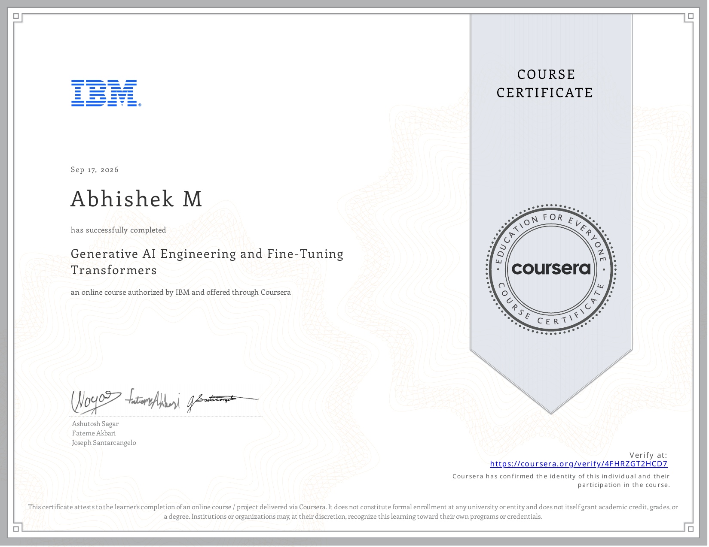

# Course 10: Generative AI Engineering and Fine-Tuning Transformers

**Status:** ✅ Completed

## Certificate

## Overview
This course has been completed. It covers Generative AI engineering, fine-tuning transformers, LoRA, and QLoRA.

## Completed Notebooks
- [Adapters in PyTorch](./notebooks/Adapters_in_PyTorch.ipynb)
- [Fine-Tuning Transformers with PyTorch and Hugging Face](./notebooks/Fine-Tuning_Transformers_with_PyTorch_and_Hugging_Face.ipynb)
- [LoRA with Pytorch](./notebooks/LoRA_with_Pytorch.ipynb)
- [Loading Models and Inference with Hugging Face](./notebooks/Loading_Models_and_Inference_with_Hugging_Face.ipynb)
- [Optional Pre-training LLMs with Hugging Face](./notebooks/Optional_Pre-training_LLMs_with_Hugging_Face.ipynb)
- [Pre-Training and Fine-Tuning with PyTorch](./notebooks/Pre-Training_and_Fine-Tuning_with_PyTorch.ipynb)
- [QLoRA with HuggingFace](./notebooks/QLoRA_with_HuggingFace.ipynb)

## Resources
- [Cheat Sheet](./resources/Cheat_Sheet.pdf)
- [Glossary](./resources/Glossary.pdf)
- [softprompts](./resources/softprompts.pdf)
