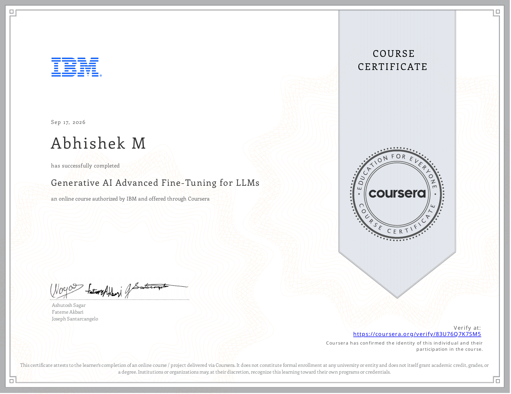

# Course 11 — Generative AI Advanced Fine-Tuning for LLMs

## Certificate

  

## About the Course
This course focuses on advanced fine-tuning techniques for LLMs including DPO, Reward Modeling, and PPO.

## What I Learned
* Instruction Fine-Tuning
* Reward Modeling
* Proximal Policy Optimization (PPO)
* Direct Preference Optimization (DPO)

## Project Files / Notebooks
* [DPO Fine-Tuning](./notebooks/DPO_Fine-Tuning.ipynb)
* [Instruction fine-tuning](./notebooks/Instruction_fine-tuning.ipynb)
* [PPOTrainer](./notebooks/PPOTrainer.ipynb)
* [Reward Modeling](./notebooks/Reward_Modeling.ipynb)

## Resources
* [Cheat Sheet](./resources/Cheat_Sheet.pdf)
* [Fine-Tune LLMs Locally with InstructLab](./resources/Fine-Tune_LLMs_Locally_with_InstructLab.pdf)
* [Glossary](./resources/Glossary.pdf)
* [Instruction Tuning](./resources/Instruction_Tuning.pdf)
* [Proximal policy optimization (PPO) algorithm](./resources/Proximal_policy_optimization_(PPO)_algorithm.pdf)
* [Reinforcement Learning](./resources/Reinforcement_Learning.pdf)
* [Reward Modeling & Response Evaluation](./resources/Reward_Modeling_&_Response_Evaluation.pdf)

## Skills Demonstrated
* RLHF
* DPO
* PPO
* Reward Modeling
