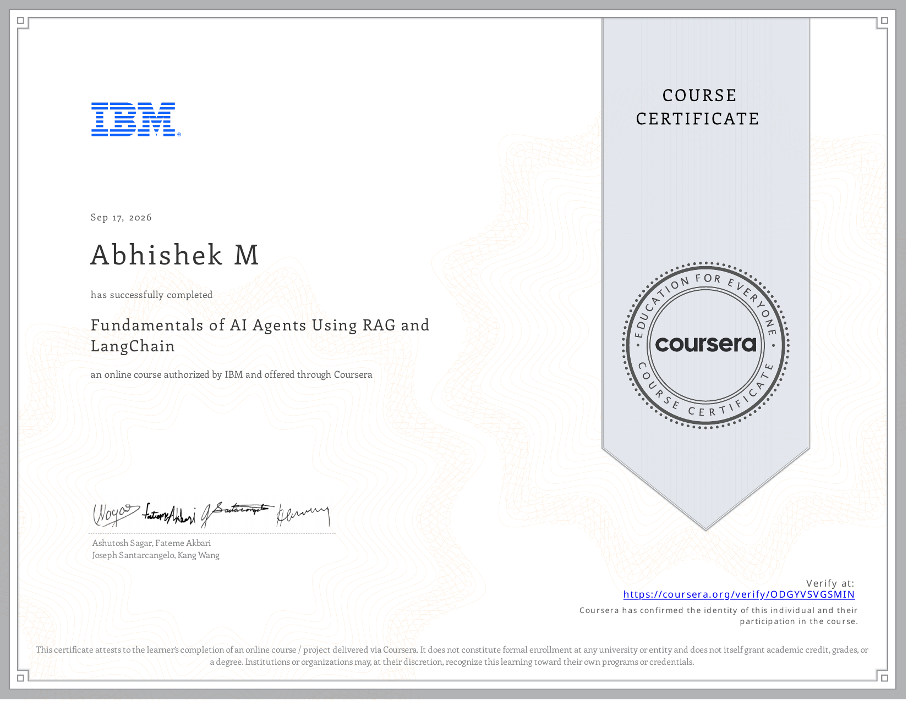

# Course 12: Fundamentals of AI Agents Using RAG and LangChain

**Status:** ✅ Completed

## Certificate

## Overview
This course has been completed. It covers RAG applications, LangChain, contextual learning, and building AI agents.

## Completed Notebooks
- [Build Smarter AI Apps Empower LLMs with LangChain](./notebooks/Build_Smarter_AI_Apps_Empower_LLMs_with_LangChain.ipynb)
- [Building AI Agents from Scratch - Weather Agent Daily Dish](./notebooks/Building_AI_Agents_from_Scratch_-_Weather_Agent_Daily_Dish.ipynb)
- [In-Context Learning and Prompt Templates for Advanced AI](./notebooks/In-Context_Learning_and_Prompt_Templates_for_Advanced_AI.ipynb)
- [RAG with Hugging Face](./notebooks/RAG_with_Hugging_Face.ipynb)
- [RAG with Pytorch](./notebooks/RAG_with_Pytorch.ipynb)
- [Summarize private documents using RAG LangChain and LLMs](./notebooks/Summarize_private_documents_using_RAG_LangChain_and_LLMs.ipynb)
