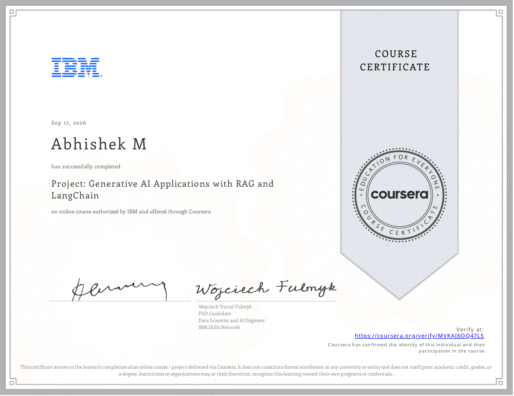

# Course 13: Project: Generative AI

**Status:** ✅ Completed

## Certificate

## Overview
This course has been completed. It covers Capstone project applying RAG, LangChain, QA bots, and Gradio interfaces.

## Completed Notebooks
- [Embed documents with watsonx s embedding](./notebooks/Embed_documents_with_watsonx_s_embedding.ipynb)
- [Full document retrieve limitation](./notebooks/Full_document_retrieve_limitation.ipynb)
- [LangChain document loader](./notebooks/LangChain_document_loader.ipynb)
- [LangChain retriever](./notebooks/LangChain_retriever.ipynb)
- [LangChain text-splitter](./notebooks/LangChain_text-splitter.ipynb)
- [LangChain vector store](./notebooks/LangChain_vector_store.ipynb)

## Resources
- [Cheat Sheet- Project- Generative AI Applications with RAG and LangChain](./resources/Cheat_Sheet-_Project-_Generative_AI_Applications_with_RAG_and_LangChain.pdf)
- [Compare Fine-Tuning Using InstructLab with RAG](./resources/Compare_Fine-Tuning_Using_InstructLab_with_RAG.pdf)
- [Construct a QA Bot](./resources/Construct_a_QA_Bot.pdf)
- [Construct a QA Bot that Leverages](./resources/Construct_a_QA_Bot_that_Leverages.pdf)
- [Course Glossary](./resources/Course_Glossary.pdf)
- [Embed documents using watsonx's embedding model](./resources/Embed_documents_using_watsonx's_embedding_model.pdf)
- [Project Overview](./resources/Project_Overview.pdf)
- [Set Up a Simple Gradio Interface](./resources/Set_Up_a_Simple_Gradio_Interface.pdf)
