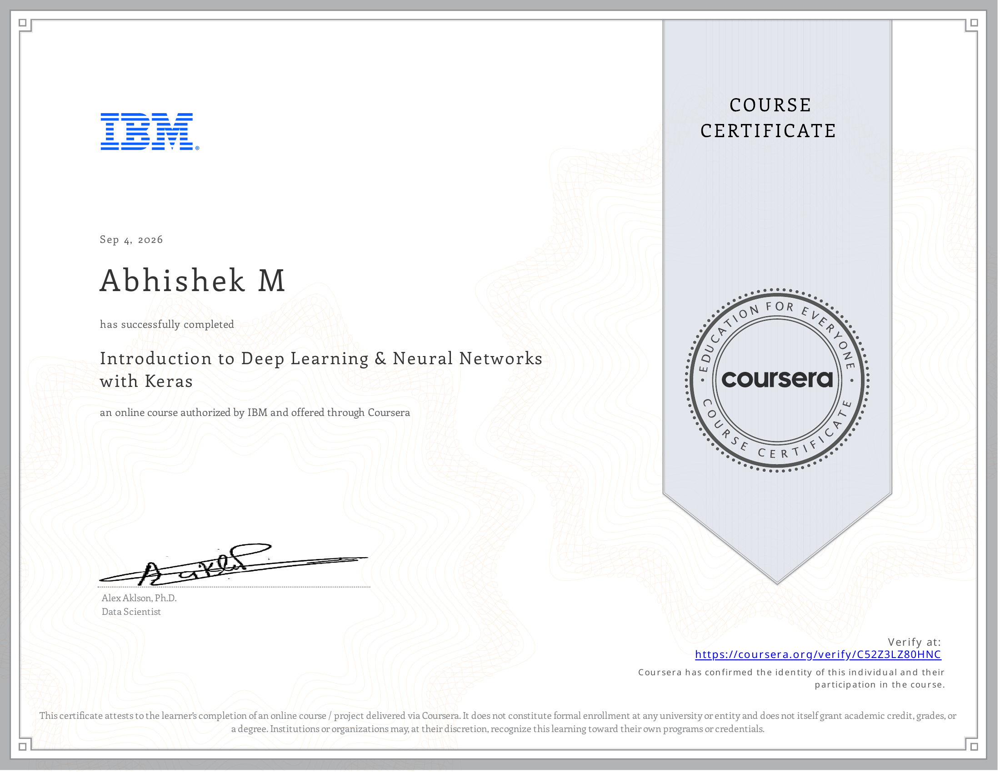

# Course 2 — Introduction to Deep Learning & Neural Networks with Keras

## Certificate

  

## About the Course
This foundational deep learning course introduces neural network architectures and practical implementation using Keras and TensorFlow.

## What I Learned
* Neural Network Fundamentals
* Forward and Backward Propagation
* Building models with Keras
* Optimizers and Loss Functions

## Project Files / Notebooks
* [Activation Functions and Vanishing Gradient](./notebooks/Activation_Functions_and_Vanishing_Gradient.ipynb)
* [Artificial Neural Networks Forward Propagation](./notebooks/Artificial_Neural_Networks_Forward_Propagation.ipynb)
* [Backpropagation](./notebooks/Backpropagation.ipynb)
* [Classification with Keras](./notebooks/Classification_with_Keras.ipynb)
* [Convolutional Neural Networks with Keras](./notebooks/Convolutional_Neural_Networks_with_Keras.ipynb)
* [Final Project Aircraft Damage Classification](./notebooks/Final_Project_Aircraft_Damage_Classification.ipynb)
* [Regression with Keras](./notebooks/Regression_with_Keras.ipynb)
* [Transformers with Keras](./notebooks/Transformers_with_Keras.ipynb)

## Skills Demonstrated
* Deep Learning
* Keras
* TensorFlow
* Neural Networks
