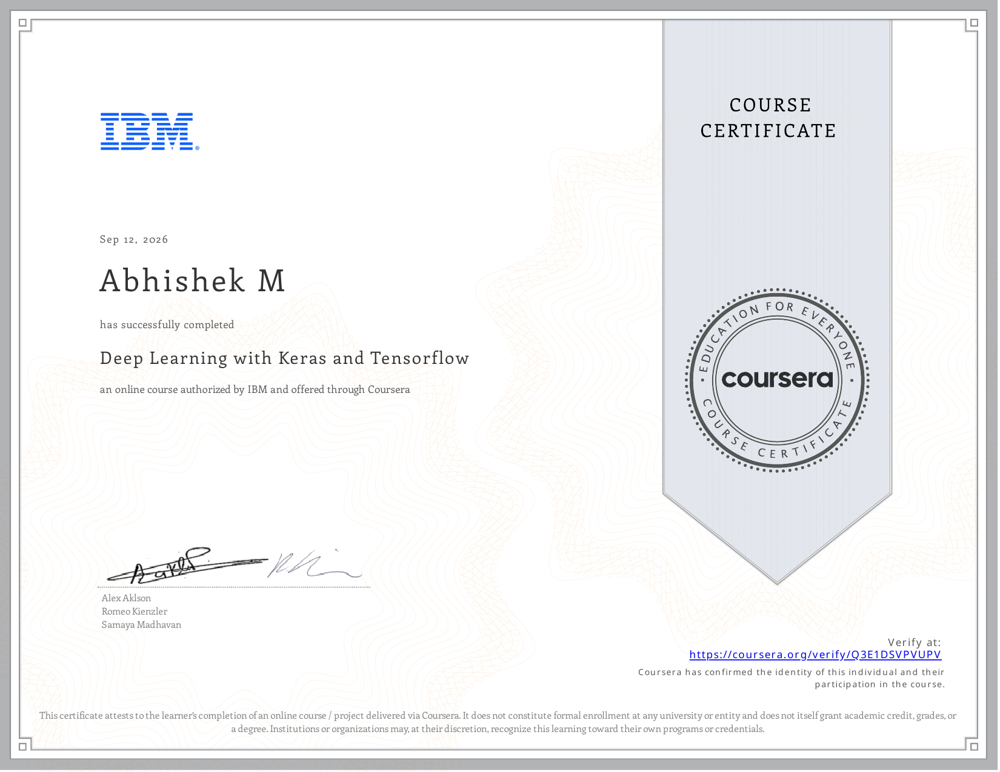

# Course 3: Deep Learning with Keras and TensorFlow

**Status:** ✅ Completed

## Certificate

## Overview
This course focuses on building, training, and deploying advanced Deep Learning models using Keras and TensorFlow. It covers the Functional API, custom layers, transfer learning, transformers, generative models (Autoencoders, GANs, Diffusion models), custom training loops, hyperparameter tuning, and reinforcement learning.

## Completed Notebooks

### Keras Foundations & Custom Architectures
- [Implementing the Functional API in Keras](./notebooks/Implementing_Functional_API_in_Keras.ipynb)
- [Creating Custom Layers and Models](./notebooks/Creating_Custom_Layers_and_Models.ipynb)
- [Practical Application of Transpose Convolution](./notebooks/Practical_Application_of_Transpose_Convolution.ipynb)

### Data Augmentation & Transfer Learning
- [Advanced Data Augmentation with Keras](./notebooks/Advanced_Data_Augmentation_with_Keras.ipynb)
- [Transfer Learning Implementation](./notebooks/Transfer_Learning_Implementation.ipynb)

### Transformers
- [Implementing Transformers for Text Generation](./notebooks/Implementing_Transformers_for_Text_Generation.ipynb)
- [Building Advanced Transformers (Review)](./notebooks/Building_Advanced_Transformers.ipynb)

### Generative Models
- [Building Autoencoders](./notebooks/Building_Autoencoders.ipynb)
- [Develop GANs using Keras](./notebooks/Develop_GANs_using_Keras.ipynb)
- [Implementing Diffusion Models](./notebooks/Implementing_Diffusion_Models.ipynb)

### Custom Training & Tuning
- [Custom Training Loops in Keras](./notebooks/Custom_Training_Loops_in_Keras.ipynb)
- [Hyperparameter Tuning with Keras Tuner](./notebooks/Hyperparameter_Tuning_with_Keras_Tuner.ipynb)

### Reinforcement Learning
- [Implementing Q-Learning in Keras](./notebooks/Implementing_Q_Learning_in_Keras.ipynb)
- [Building a Deep Q-Network with Keras](./notebooks/Building_Deep_Q_Network_with_Keras.ipynb)

### Projects
- **Practice Project:** [Fruit Classification Using TensorFlow](./notebooks/Practice_Project_Fruit_Classification.ipynb)
- **Final Project:** [Classify Waste Products Using Transfer Learning and Fine-Tuning](./notebooks/Final_Project_Classify_Waste_Products.ipynb)
