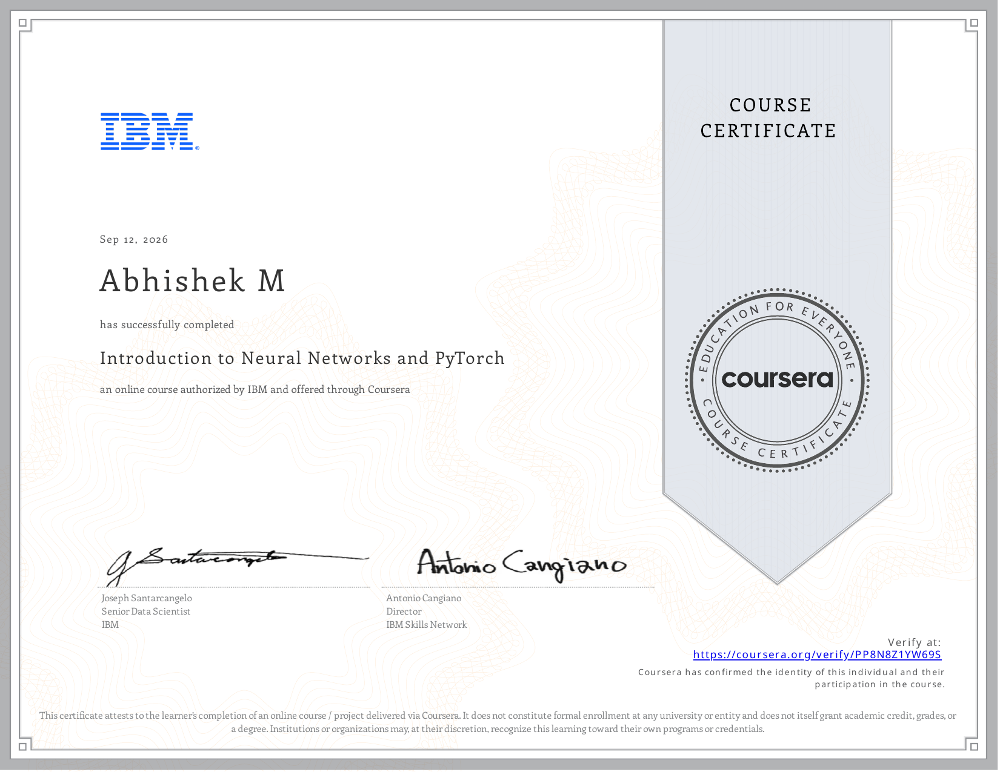

# Course 4 — Introduction to Neural Networks and PyTorch

## Certificate

  

## About the Course
This course covers the fundamentals of building deep learning models from scratch using PyTorch.

## What I Learned
* Tensors and Autograd in PyTorch
* Linear Regression and Logistic Regression with PyTorch
* Deep Neural Networks
* PyTorch Data Loaders

## Project Files / Notebooks
* [Dtensors](./notebooks/Dtensors.ipynb)
* [Final Project League of Legends Match Predictor](./notebooks/Final_Project_League_of_Legends_Match_Predictor.ipynb)
* [Linear Regression Multiple Outputs-Copy1](./notebooks/Linear_Regression_Multiple_Outputs-Copy1.ipynb)
* [Practice Project Breast Cancer Classification](./notebooks/Practice_Project_Breast_Cancer_Classification.ipynb)
* [Prediction1Dregression](./notebooks/Prediction1Dregression.ipynb)
* [PyTorchway](./notebooks/PyTorchway.ipynb)
* [Two-Dimensional Tensors](./notebooks/Two-Dimensional_Tensors.ipynb)
* [bad inshilization logistic regression with m](./notebooks/bad_inshilization_logistic_regression_with_m.ipynb)
* [cross entropy logistic regression](./notebooks/cross_entropy_logistic_regression.ipynb)
* [derivativesandGraphsinPytorch](./notebooks/derivativesandGraphsinPytorch.ipynb)
* [logistic regression prediction](./notebooks/logistic_regression_prediction.ipynb)
* [mini-batch gradient descent](./notebooks/mini-batch_gradient_descent.ipynb)
* [multiple linear regression prediction](./notebooks/multiple_linear_regression_prediction.ipynb)
* [multiple linear regression training](./notebooks/multiple_linear_regression_training.ipynb)
* [pre-Built Datasets and transforms](./notebooks/pre-Built_Datasets_and_transforms.ipynb)
* [simple data set](./notebooks/simple_data_set.ipynb)
* [stochastic gradient descent](./notebooks/stochastic_gradient_descent.ipynb)
* [training and validation](./notebooks/training_and_validation.ipynb)
* [training linear regression multiple outputs](./notebooks/training_linear_regression_multiple_outputs.ipynb)
* [training slope and bias](./notebooks/training_slope_and_bias.ipynb)

## Skills Demonstrated
* PyTorch
* Autograd
* Neural Networks
