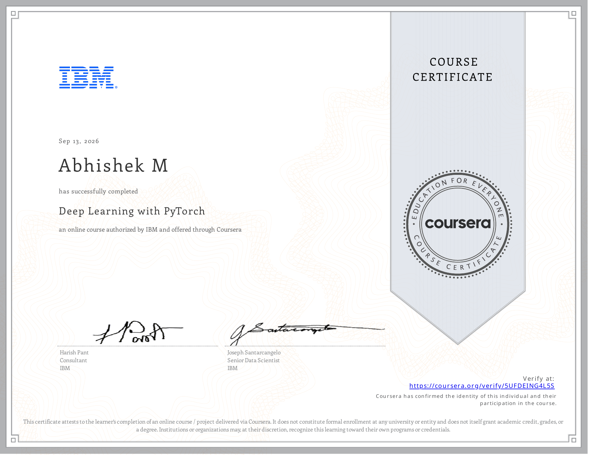

# Course 5 — Deep Learning with PyTorch

## Certificate

  

## About the Course
This course explores advanced PyTorch techniques, focusing on CNNs, image classification, and transfer learning.

## What I Learned
* CNN architectures in PyTorch
* Transfer Learning (ResNet, VGG)
* Image Data Augmentation
* Model evaluation and tuning

## Project Files / Notebooks
* [Activation Functions](./notebooks/Activation_Functions.ipynb)
* [Activation Functions and Max Pooling](./notebooks/Activation_Functions_and_Max_Pooling.ipynb)
* [Batch Normalization](./notebooks/Batch_Normalization.ipynb)
* [Convolutional Neural Network Simple Example](./notebooks/Convolutional_Neural_Network_Simple_Example.ipynb)
* [Convolutional Neural Network Small Image](./notebooks/Convolutional_Neural_Network_Small_Image.ipynb)
* [Convolutional Neural Network Small Image Batch Norm](./notebooks/Convolutional_Neural_Network_Small_Image_Batch_Norm.ipynb)
* [Default Weight Initialization](./notebooks/Default_Weight_Initialization.ipynb)
* [Dropout for Classification](./notebooks/Dropout_for_Classification.ipynb)
* [Dropout for Regression](./notebooks/Dropout_for_Regression.ipynb)
* [Final Project Fashion MNIST Classification](./notebooks/Final_Project_Fashion_MNIST_Classification.ipynb)
* [He Initialization MNIST](./notebooks/He_Initialization_MNIST.ipynb)
* [MNIST One Hidden Layer with Activation](./notebooks/MNIST_One_Hidden_Layer_with_Activation.ipynb)
* [MNIST Two Hidden Layers](./notebooks/MNIST_Two_Hidden_Layers.ipynb)
* [Momentum with Polynomial Functions](./notebooks/Momentum_with_Polynomial_Functions.ipynb)
* [Multiclass Classification Spiral Dataset ReLU](./notebooks/Multiclass_Classification_Spiral_Dataset_ReLU.ipynb)
* [Multiple Channel Convolution](./notebooks/Multiple_Channel_Convolution.ipynb)
* [Neural Networks for XOR Problem](./notebooks/Neural_Networks_for_XOR_Problem.ipynb)
* [Neural Networks with Momentum](./notebooks/Neural_Networks_with_Momentum.ipynb)
* [Neural Networks with Multiple Neurons](./notebooks/Neural_Networks_with_Multiple_Neurons.ipynb)
* [One Hidden Layer Neural Network MNIST](./notebooks/One_Hidden_Layer_Neural_Network_MNIST.ipynb)
* [Practice Project CNN Anime Image Classification](./notebooks/Practice_Project_CNN_Anime_Image_Classification.ipynb)
* [Predicting MNIST using Softmax](./notebooks/Predicting_MNIST_using_Softmax.ipynb)
* [Simple One Hidden Layer Neural Network](./notebooks/Simple_One_Hidden_Layer_Neural_Network.ipynb)
* [Softmax in One Dimension](./notebooks/Softmax_in_One_Dimension.ipynb)
* [What is Convolution](./notebooks/What_is_Convolution.ipynb)
* [Xavier Initialization MNIST](./notebooks/Xavier_Initialization_MNIST.ipynb)

## Skills Demonstrated
* PyTorch
* Computer Vision
* CNNs
* Transfer Learning
