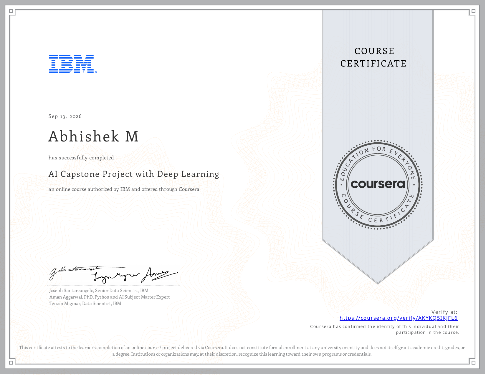

# Course 6 — AI Capstone Project with Deep Learning

## Certificate

  

## About the Course
This capstone project focuses on building, training, evaluating, and comparing end-to-end Deep Learning models for satellite land/agricultural image classification.

## What I Learned
* End-to-End Deep Learning Pipelines
* Comparative Analysis of PyTorch vs Keras
* Vision Transformers (ViT)
* CNN-ViT Hybrid Architectures

## Project Files / Notebooks
* [Module 1 Lab 1 Comparison of Memory Based and Generator Based Data Loading](./notebooks/Module_1_Lab_1_Comparison_of_Memory_Based_and_Generator_Based_Data_Loading.ipynb)
* [Module 1 Lab 2 Data Loading and Augmentation Using Keras](./notebooks/Module_1_Lab_2_Data_Loading_and_Augmentation_Using_Keras.ipynb)
* [Module 1 Lab 3 Data Loading and Augmentation Using PyTorch](./notebooks/Module_1_Lab_3_Data_Loading_and_Augmentation_Using_PyTorch.ipynb)
* [Module 2 Lab 1 Train and Evaluate a Keras Based Classifier](./notebooks/Module_2_Lab_1_Train_and_Evaluate_a_Keras_Based_Classifier.ipynb)
* [Module 2 Lab 2 Implement and Test a PyTorch Based Classifier](./notebooks/Module_2_Lab_2_Implement_and_Test_a_PyTorch_Based_Classifier.ipynb)
* [Module 2 Lab 3 Comparative Analysis of Keras and PyTorch Models](./notebooks/Module_2_Lab_3_Comparative_Analysis_of_Keras_and_PyTorch_Models.ipynb)
* [Module 3 Lab 1 Vision Transformers in Keras](./notebooks/Module_3_Lab_1_Vision_Transformers_in_Keras.ipynb)
* [Module 3 Lab 2 Vision Transformers in PyTorch](./notebooks/Module_3_Lab_2_Vision_Transformers_in_PyTorch.ipynb)
* [Module 3 Lab 3 Land Classification CNN ViT Integration Evaluation](./notebooks/Module_3_Lab_3_Land_Classification_CNN_ViT_Integration_Evaluation.ipynb)

## Skills Demonstrated
* Model Evaluation
* Vision Transformers
* Keras
* PyTorch
