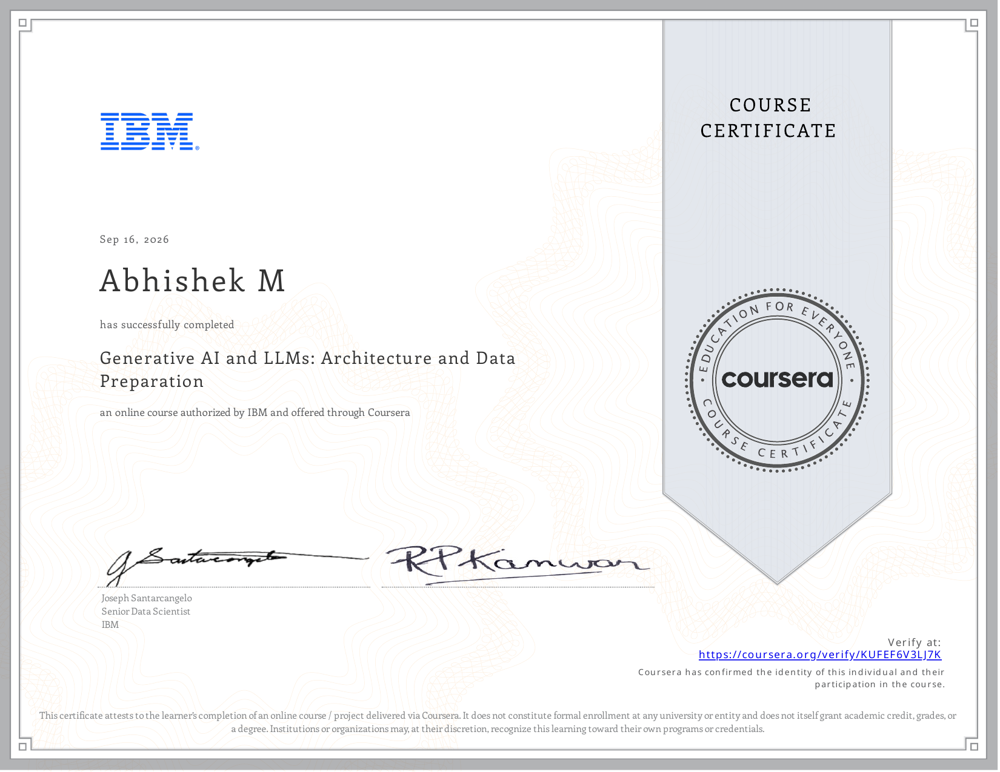

# Course 7 — Generative AI and LLMs: Architecture and Data Preparation

## Certificate

  

## About the Course
This course covers the foundational architecture of Large Language Models (LLMs), tokenization, and data preparation techniques.

## What I Learned
* Generative AI Libraries
* LLM Architecture
* Tokenization Techniques
* NLP Data Loading

## Project Files / Notebooks
* [Creating an NLP Data Loader](./notebooks/Creating_an_NLP_Data_Loader.ipynb)
* [Exploring Generative AI Libraries](./notebooks/Exploring_Generative_AI_Libraries.ipynb)
* [Implementing Tokenization](./notebooks/Implementing_Tokenization.ipynb)

## Resources
* [Cheat Sheet: GenAI & LLMs: Architecture and Data Preparation](./resources/Cheat_Sheet:_GenAI_&_LLMs:_Architecture_and_Data_Preparation.pdf)
* [Course Glossary](./resources/Course_Glossary.pdf)

## Skills Demonstrated
* Generative AI
* LLMs
* Tokenization
* NLP
