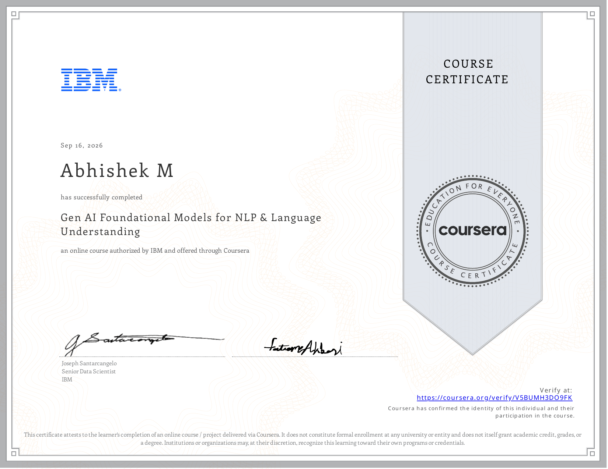

# Course 8: Gen AI Foundational Models for NLP & Language Understanding

> **Status: ✅ Completed**

## Certificate

## Overview
This course covers foundational models for NLP, language understanding, Word2Vec, sequence-to-sequence models, and document classification.

## Completed Notebooks
- [Classifying Document](./notebooks/Classifying_Document.ipynb)
- [Developing a Sequence-to-Sequence Model](./notebooks/Developing_a_Sequence-to-Sequence_Model.ipynb)
- [Feed Forward Neural Networks](./notebooks/FeedForwardNeuralNetworks.ipynb)
- [Integrating Word2Vec Part 1](./notebooks/Integrating_Word2Vec_Part1.ipynb)
- [Integrating Word2Vec Part 2](./notebooks/Integrating_Word2Vec_Part2.ipynb)
- [Language Modelling](./notebooks/LanguageModelling.ipynb)
