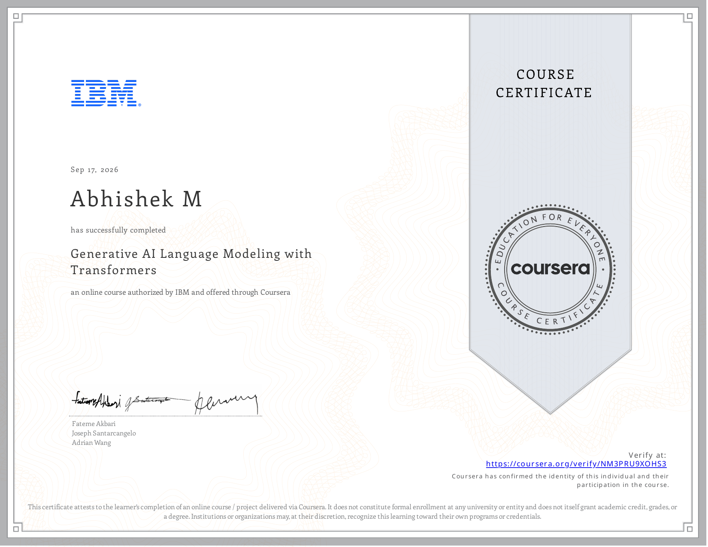

# Course 9: Generative AI Language Modeling with Transformers

**Status:** ✅ Completed

## Certificate

## Overview
This course has been completed. It covers Language modeling, transformer fundamentals, attention mechanism, and positional encoding.

## Completed Notebooks
- [Attention Mechanism and Positional Encoding](./notebooks/Attention_Mechanism_and_Positional_Encoding.ipynb)
- [Data Preparations for BERT](./notebooks/Data_Preparations_for_BERT.ipynb)
- [Decoder Causal LM GPT-like Models](./notebooks/Decoder_Causal_LM_GPT-like_Models.ipynb)
- [Encoder Models with Baby BERT](./notebooks/Encoder_Models_with_Baby_BERT.ipynb)
- [M3-L2-Applying Transformers for Classification](./notebooks/M3-L2-Applying_Transformers_for_Classification.ipynb)
- [M3-L3-Transformers for Translation](./notebooks/M3-L3-Transformers_for_Translation.ipynb)

## Resources
- [Beginner's Guide to Transformer Model Fundamentals](./resources/Beginner's_Guide_to_Transformer_Model_Fundamentals)
- [Cheat Sheet](./resources/Cheat_Sheet.pdf)
- [Getting Started with Advanced Concepts of Transformer Models](./resources/Getting_Started_with_Advanced_Concepts_of_Transformer_Models.pdf)
- [Glossary](./resources/Glossary.pdf)
