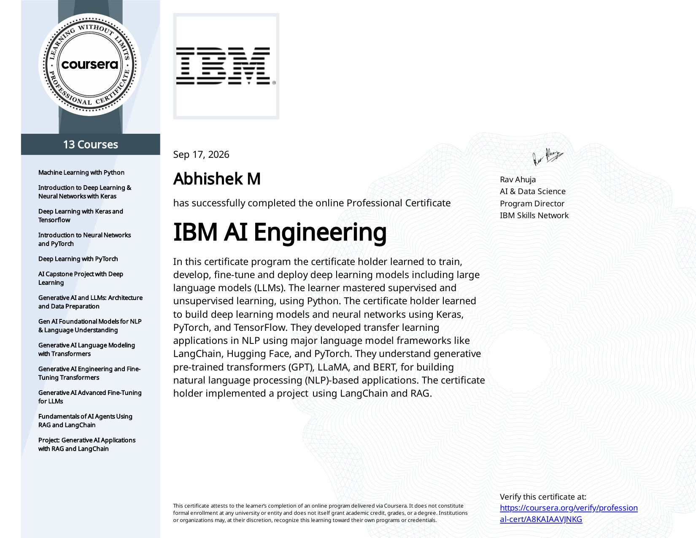

# IBM AI Engineering Professional Certificate Portfolio

This repository documents my completion of the **[IBM AI Engineering Professional Certificate](https://www.coursera.org/professional-certificates/ai-engineer)** on Coursera. It contains all course certificates, learning summaries, and the extensive projects completed throughout the program, including the final Capstone projects.

## Professional Certificate

  <table style="border: none; background-color: transparent;">
    <tr style="border: none; background-color: transparent;">
      <td align="center" style="border: none; background-color: transparent;">
        
      </td>
      <td align="center" style="border: none; background-color: transparent;">
        <a href="https://www.coursera.org/professional-certificates/ai-engineer"><b>View Program on Coursera</b></a>
      </td>
    </tr>
  </table>

## Courses

The program consists of 13 distinct courses. Click on each course to view the specific certificate, learning objectives, and related project work.

| Course | Topics / Skills | Project |
| :--- | :--- | :--- |
| [Course 1: Machine Learning with Python](./Course-1-Machine-Learning-with-Python) | Scikit-learn, Classification, Regression | ML Pipeline Implementation |
| [Course 2: Introduction to Deep Learning & Neural Networks with Keras](./Course-2-Introduction-to-Deep-Learning) | Neural Networks, Keras, TensorFlow | Simple Neural Net Implementation |
| [Course 3: Deep Learning with Keras and Tensorflow](./Course-3-Deep-Learning-Keras-TensorFlow) | CNNs, Computer Vision, Transfer Learning | CNN Image Classifier |
| [Course 4: Introduction to Neural Networks and PyTorch](./Course-4-Neural-Networks-PyTorch) | PyTorch, Tensors, Autograd | PyTorch Logistic Regression |
| [Course 5: Deep Learning with PyTorch](./Course-5-Deep-Learning-PyTorch) | PyTorch, Transfer Learning (ResNet, VGG) | PyTorch Image Classifier |
| [Course 6: AI Capstone Project with Deep Learning](./Course-6-AI-Capstone-Deep-Learning) | ViT, Keras vs PyTorch, Model Evaluation | **Satellite Image Classification Capstone** |
| [Course 7: Generative AI and LLMs: Architecture and Data Preparation](./Course-7-Generative-AI-LLMs-Architecture) | LLM Architecture, Tokenization, Data Loaders | NLP Tokenization Pipeline |
| [Course 8: Gen AI Foundational Models for NLP & Language Understanding](./Course-8-Gen-AI-NLP-Language-Understanding) | Word2Vec, Seq2Seq, Document Classification | Text Classification Model |
| [Course 9: Generative AI Language Modeling with Transformers](./Course-9-Generative-AI-Language-Modeling) | Attention Mechanism, Positional Encoding | Transformer Model Walkthrough |
| [Course 10: Generative AI Engineering and Fine-Tuning Transformers](./Course-10-Generative-AI-Engineering-FineTuning) | LoRA, QLoRA, PEFT, Hugging Face | LLM Fine-Tuning Implementation |
| [Course 11: Generative AI Advanced Fine-Tuning for LLMs](./Course-11-Generative-AI-Advanced-FineTuning) | RLHF, DPO, PPO, Reward Modeling | Advanced RLHF Pipeline |
| [Course 12: Fundamentals of AI Agents Using RAG and LangChain](./Course-12-AI-Agents-RAG-LangChain) | RAG, LangChain, AI Agents | Simple LangChain Agent |
| [Course 13: Project: Generative AI](./Course-13-Project-Generative-AI) | RAG, Vector Stores, Gradio UI | **Generative AI QA Bot Capstone** |

## Skills & Tools

Throughout the program, I developed proficiency in the following tools and techniques:

* **Programming:** Python, Jupyter Notebook
* **Libraries:** Scikit-learn, Pandas, NumPy, Matplotlib, Hugging Face
* **Deep Learning Frameworks:** Keras, TensorFlow, PyTorch
* **Machine Learning:** Regression, Classification, Clustering, Ensembles
* **Computer Vision:** Convolutional Neural Networks (CNNs), Vision Transformers (ViT), Transfer Learning
* **Natural Language Processing:** Word2Vec, Seq2Seq, Transformers, Attention Mechanisms
* **Generative AI:** Large Language Models (LLMs), PEFT (LoRA, QLoRA), RLHF (DPO, PPO), LangChain, RAG

## Projects

The primary practical components of this program were the extensive capstone projects bridging together the concepts learned across multiple courses.

* **[AI Capstone Project with Deep Learning (Course 6)](./Course-6-AI-Capstone-Deep-Learning)**: Developed an end-to-end deep learning pipeline for satellite image classification. Designed and compared multiple architectures including standard CNNs, Vision Transformers (ViTs), and hybrid models using both Keras and PyTorch.
* **[Project: Generative AI (Course 13)](./Course-13-Project-Generative-AI)**: Constructed a robust Retrieval-Augmented Generation (RAG) Question & Answering bot using LangChain. Implemented document chunking, embedded text with vector stores, and deployed an interactive Gradio user interface for the AI agent.

---
**Note:** The project materials within this repository have been reconstructed from publicly available reference materials to serve as a portfolio demonstrating my skills and completion of the IBM AI Engineering curriculum.
